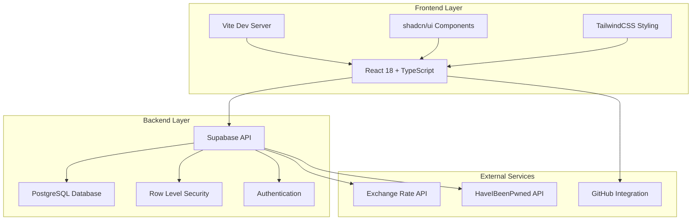
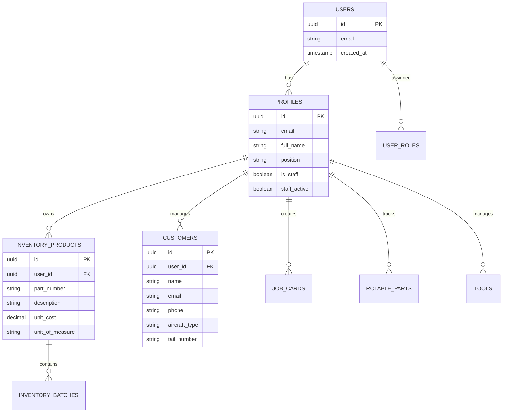
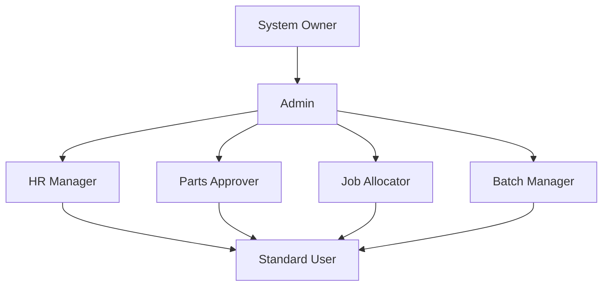
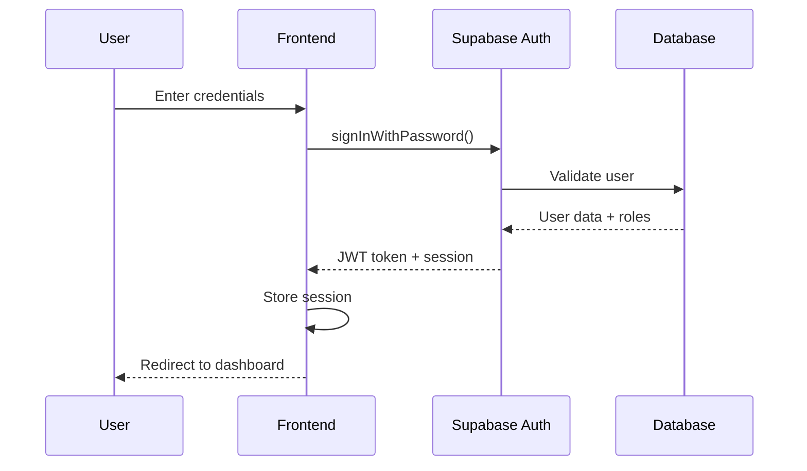
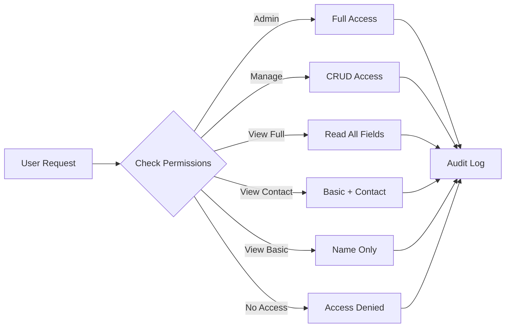
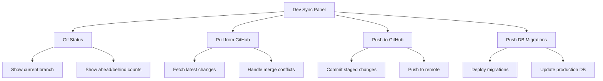

# Station-2100 - Aviation Management System

[](https://opensource.org/licenses/MIT)
[](https://reactjs.org/)
[](https://www.typescriptlang.org/)
[](https://supabase.com/)
[](https://vitejs.dev/)
[](https://raw.githubusercontent.com/gtthande/dev-profiles/main/Dev_Profile_and_Cursor_Prompt_Pack.md)

## Table of Contents

- [Project Overview](#project-overview)
- [Quick Start](#quick-start)
- [System Architecture](#system-architecture)
- [Features](#features)
- [Authentication & Security](#authentication--security)
- [Development Setup](#development-setup)
- [Documentation](#documentation)
- [Deployment](#deployment)
- [Contributing](#contributing)

## Project Overview

**Station-2100** is a comprehensive aviation inventory and job card management system designed for aviation maintenance professionals. Built with modern web technologies, it provides secure, role-based access to inventory management, job card workflows, customer data, and rotable parts lifecycle tracking.

### 🛩️ **Core Capabilities**
- **Inventory Management**: Complete product catalog with batch tracking and approval workflows
- **Job Card System**: Aviation-specific job card creation and multi-level approval processes
- **Customer Management**: Secure customer data with granular permission controls
- **Rotable Parts**: Full lifecycle tracking for aviation rotable components
- **Tool Management**: Tool checkout/check-in system with tracking
- **Exchange Rates**: Real-time currency conversion for international operations
- **Security**: Enterprise-grade security with audit logging and data protection

### 🏗️ **Technology Stack**
- **Frontend**: React 18, TypeScript, Vite, TailwindCSS
- **Backend**: Supabase (PostgreSQL, Auth, Storage, Realtime)
- **UI Components**: shadcn/ui, Radix UI primitives
- **State Management**: TanStack Query (React Query)
- **Form Handling**: React Hook Form with Zod validation
- **Security**: Row-Level Security, AES-256 encryption, comprehensive audit logging

## Quick Start

### 🚀 **Get Started in 3 Steps**

1. **Clone and Setup**
   ```bash
   git clone https://github.com/gtthande/Station-2100.git
   cd Station-2100
   npm ci --prefer-offline --no-audit --no-fund
   ```

2. **Configure Environment**
   ```bash
   # Environment file is auto-created from template
   # Edit .env.local with your Supabase credentials if needed
   ```

3. **Start Development Server**
   ```bash
   npm run dev
   # Open http://localhost:8080
   ```

### 🔄 **Alternative: Automated Setup**
```powershell
# Windows PowerShell - Automated setup
.\Station-2100.ps1
# or
.\scripts\setup-and-run.ps1
```

### 🔐 **Default Admin Access**
- **Email**: `gtthande@gmail.com`
- **Password**: `Password100%`
- **Role**: System Administrator

## System Architecture

### 🏗️ **High-Level Architecture**



### 📊 **Database Architecture**



## Features

### 🛩️ **Aviation-Specific Features**

#### **Inventory Management**
- **Product Catalog**: Complete part number management with descriptions and specifications
- **Batch Tracking**: Lot-based inventory tracking with expiry dates and approval workflows
- **Multi-Currency Support**: Real-time exchange rate conversion (USD, EUR, SCR → KES)
- **Stock Valuation**: Automated cost calculations with weighted average pricing
- **Reorder Management**: Automated reorder point calculations and notifications

#### **Job Card System**
- **Multi-Level Approval**: Warehouse A, B/C, and Owner Supplied approval workflows
- **Aircraft Integration**: Tail number and aircraft type tracking
- **Customer Integration**: Direct customer and aircraft association
- **Status Tracking**: Draft → Pending → Approved → Active workflow

#### **Rotable Parts Lifecycle**
- **Status Management**: Serviceable → In Service → Repair → Scrapped
- **Flight Tracking**: Hours and cycles tracking with compliance monitoring
- **Installation Logs**: Complete installation and removal history
- **Repair/Exchange**: Track repair history and exchange records

### 🔐 **Security & Access Control**

#### **Role-Based Access Control**


#### **Customer Data Permissions**
- **Admin**: Full access to all customer data
- **Manage**: CRUD operations on customer records
- **View Full**: Access to all customer fields including contact information
- **View Contact**: Basic information plus phone/email
- **View Basic**: Company name and basic information only

### 📈 **Reporting & Analytics**
- **Stock Valuation Reports**: Real-time inventory value calculations
- **Movement Reports**: Detailed stock movement history
- **Batch Reports**: Batch status and approval tracking
- **Customer Reports**: Customer activity and engagement metrics
- **Audit Reports**: Security and access audit trails

## Authentication & Security

### 🔐 **Authentication System**

#### **User Authentication Flow**


#### **Security Features**
- **Password Security**: Real-time strength validation with HaveIBeenPwned integration
- **Session Management**: Secure JWT tokens with automatic refresh
- **Multi-Factor Authentication**: Ready for MFA implementation
- **Audit Logging**: Comprehensive security event tracking
- **Data Encryption**: AES-256 encryption for sensitive data
- **Row-Level Security**: Database-level access control

### 🛡️ **Data Protection**

#### **Customer Data Security**


#### **Emergency Access Procedures**
- **Admin Override**: Controlled emergency access with justification
- **Audit Trail**: All emergency access logged with detailed reasoning
- **Time-Limited**: Emergency access automatically expires
- **Approval Required**: Multi-level approval for sensitive operations

## Development Setup

### 🛠️ **Prerequisites**
- **Node.js**: v18 or higher
- **npm**: Latest version
- **Git**: For version control
- **Supabase Account**: For backend services

### 📋 **Environment Configuration**

#### **Required Environment Variables**
```bash
# Supabase Configuration
VITE_SUPABASE_URL=https://jarlvtojzqkccovburmi.supabase.co
VITE_SUPABASE_ANON_KEY=your-anon-key-here
SUPABASE_SERVICE_ROLE_KEY=your-service-role-key-here

# Development Sync (Optional)
ALLOW_SYNC=1
SUPABASE_DB_PASSWORD=Series-2100Station-2100

# GitHub Integration (Optional)
VITE_GITHUB_REPO=gtthande/Station-2100
VITE_GITHUB_TOKEN=your-github-token-here

# Security (Optional)
HAVEIBEENPWNED_API_KEY=your-hibp-api-key-here
```

### 🚀 **Development Workflow**

#### **Automated Setup (Recommended)**
```powershell
# Windows PowerShell
.\Station-2100.ps1
```

This script automatically:
- Sets up environment variables
- Installs dependencies
- Starts the development server
- Verifies sync endpoints
- Displays health status

#### **Manual Setup**
```bash
# Install dependencies
npm install

# Create environment file
cp .env.example .env.local
# Edit .env.local with your credentials

# Start development server
npm run dev

# Verify setup
curl http://localhost:8080/__sync/ping
```

### 🔄 **Development Sync Features**

#### **Code & DB Sync Panel**
Available in development mode for seamless collaboration:



#### **Available Scripts**
```bash
npm run dev          # Start development server
npm run build        # Build for production
npm run preview      # Preview production build
npm run autopilot    # Dev server + watchdog
npm run sync:server  # Start sync server
npm run db:push      # Push database migrations
```

### 🧪 **Testing & Quality Assurance**

#### **Code Quality**
```bash
# Linting
npm run lint

# Type checking
npm run type-check

# Security audit
npm audit

# Dependency check
npm outdated
```

#### **Database Health Checks**
```typescript
// Health check endpoints
GET /__sync/ping     // Basic connectivity
GET /__sync/status   // Git and sync status
GET /api/health      // Application health
```

## Documentation

### 📚 **Comprehensive Documentation**

- **[Technical Documentation](./TECHNICAL_DOCUMENTATION.md)** - Complete technical architecture and implementation details
- **[User Manual](./USER_MANUAL.md)** - End-user guide and feature documentation
- **[Development Log](./DEVLOG.md)** - Development history and progress tracking
- **[Security Notes](./SECURITY_NOTES.md)** - Security implementation and best practices
- **[Architecture Documentation](./docs/architecture.md)** - System architecture and design decisions

### 🏗️ **Architecture Diagrams**

- **[Entity Relationship Diagram](./docs/architecture/erd.md)** - Complete database schema
- **[Component Architecture](./docs/architecture/components.md)** - Frontend component structure
- **[API Documentation](./docs/architecture/api.md)** - Backend API specifications
- **[Security Architecture](./docs/architecture/security.md)** - Security implementation details

## Deployment

### 🚀 **Production Deployment**

#### **Via Lovable (Recommended)**
1. **Prepare for Deployment**
   ```bash
   npm run build
   npm run type-check
   npm audit
   ```

2. **Deploy via Lovable**
   - Click "Publish" in Lovable interface
   - Configure custom domain (if required)
   - Verify deployment health

#### **Alternative Deployment Methods**

##### **Vercel Deployment**
```bash
# Install Vercel CLI
npm install -g vercel

# Deploy
vercel

# Configure environment variables in Vercel dashboard
```

##### **Netlify Deployment**
```bash
# Build project
npm run build

# Deploy to Netlify
# Upload dist/ folder or connect Git repository
```

### 🔧 **Production Configuration**

#### **Environment Variables**
```env
# Production Supabase Configuration
VITE_SUPABASE_URL=https://your-project.supabase.co
VITE_SUPABASE_ANON_KEY=your-production-anon-key

# Security Settings
VITE_ENABLE_ANALYTICS=true
VITE_ENABLE_ERROR_REPORTING=true
```

#### **Supabase Production Settings**
1. **Authentication Configuration**
   - Site URL: `https://yourdomain.com`
   - Redirect URLs: `https://yourdomain.com/**`
   - Email templates: Configure custom templates

2. **Security Settings**
   - Enable leaked password protection
   - Configure rate limiting
   - Set appropriate CORS policies

3. **Database Settings**
   - Enable connection pooling
   - Configure backup schedules
   - Monitor query performance

### 📊 **Monitoring & Health Checks**

#### **Health Check Endpoints**
```typescript
// Application health
GET /api/health

// Database connectivity
GET /api/health/db

// Authentication status
GET /api/health/auth
```

#### **Monitoring Setup**
- **Supabase Dashboard**: Monitor database performance
- **Auth Logs**: Track authentication events
- **Edge Function Logs**: Monitor serverless function performance
- **Custom Analytics**: Implement application-specific metrics

## Contributing

### 🤝 **How to Contribute**

We welcome contributions to Station-2100! Here's how you can help:

#### **Development Setup**
1. **Fork the repository**
2. **Clone your fork**
   ```bash
   git clone https://github.com/your-username/Station-2100.git
   cd Station-2100
   ```
3. **Install dependencies**
   ```bash
   npm install
   ```
4. **Create a feature branch**
   ```bash
   git checkout -b feature/your-feature-name
   ```

#### **Development Guidelines**
- **Code Style**: Follow existing TypeScript and React patterns
- **Testing**: Add tests for new features
- **Documentation**: Update relevant documentation
- **Security**: Follow security best practices
- **Performance**: Optimize for performance and accessibility

#### **Pull Request Process**
1. **Create your feature branch**
2. **Make your changes**
3. **Test thoroughly**
4. **Update documentation**
5. **Submit a pull request**

### 🐛 **Bug Reports**

When reporting bugs, please include:
- **Environment details** (OS, Node.js version, browser)
- **Steps to reproduce**
- **Expected vs actual behavior**
- **Screenshots** (if applicable)
- **Error messages** (if any)

### 💡 **Feature Requests**

For feature requests, please:
- **Check existing issues** first
- **Describe the use case** clearly
- **Explain the expected behavior**
- **Consider implementation complexity**

### 📋 **Issue Templates**

We use GitHub issue templates for:
- **Bug Reports**
- **Feature Requests**
- **Security Vulnerabilities**
- **Documentation Improvements**

## Support

### 🆘 **Getting Help**

- **Documentation**: Check the comprehensive documentation first
- **GitHub Issues**: Search existing issues or create a new one
- **Discussions**: Use GitHub Discussions for questions
- **Security**: Report security issues privately

### 🔒 **Security**

- **Security Issues**: Report via GitHub Security Advisories
- **Vulnerabilities**: Follow responsible disclosure practices
- **Audit**: Regular security audits and dependency updates

---

## License

This project is licensed under the MIT License - see the [LICENSE](LICENSE) file for details.

## Acknowledgments

- **Supabase** for the backend infrastructure
- **shadcn/ui** for the component library
- **TailwindCSS** for the styling framework
- **React Query** for state management
- **Vite** for the build tool

---

**Repository**: https://github.com/gtthande/Station-2100  
**Lovable**: https://lovable.dev/projects/3be45a24-6b88-4267-b181-6d323de70799

*Built with ❤️ for the aviation industry*