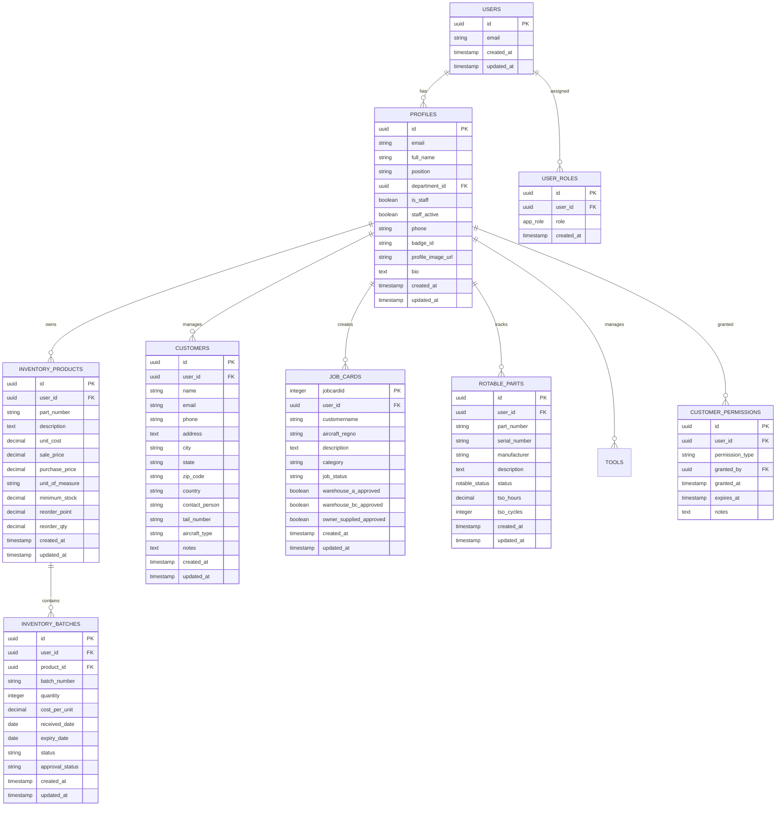

# Technical Documentation - Station-2100

[](https://opensource.org/licenses/MIT)
[](https://reactjs.org/)
[](https://www.typescriptlang.org/)
[](https://supabase.com/)
[](https://vitejs.dev/)
[](https://raw.githubusercontent.com/gtthande/dev-profiles/main/Dev_Profile_and_Cursor_Prompt_Pack.md)

## Table of Contents
1. [Project Overview](#project-overview)
2. [System Architecture](#system-architecture)
3. [Database Architecture](#database-architecture)
4. [API Reference](#api-reference)
5. [Authentication & Authorization](#authentication--authorization)
6. [Security Implementation](#security-implementation)
7. [Development Environment](#development-environment)
8. [Deployment Architecture](#deployment-architecture)
9. [Performance & Monitoring](#performance--monitoring)
10. [Troubleshooting Guide](#troubleshooting-guide)

## Project Overview

### 🛩️ **System Description**
Station-2100 is a comprehensive Aviation Inventory Management System designed specifically for aviation maintenance operations. Built with modern web technologies, it provides secure, role-based access to inventory management, job card workflows, customer data, and rotable parts lifecycle tracking.

### 🎯 **Core Capabilities**
- **Inventory Management**: Complete product catalog with batch tracking and approval workflows
- **Job Card System**: Aviation-specific job card creation and multi-level approval processes
- **Customer Management**: Secure customer data with granular permission controls
- **Rotable Parts**: Full lifecycle tracking for aviation rotable components
- **Tool Management**: Tool checkout/check-in system with tracking
- **Exchange Rates**: Real-time currency conversion for international operations
- **Security**: Enterprise-grade security with audit logging and data protection

### 🏗️ **Technology Stack**
- **Frontend**: React 18, TypeScript, Vite, TailwindCSS
- **Backend**: Supabase (PostgreSQL, Auth, Storage, Realtime)
- **UI Components**: shadcn/ui, Radix UI primitives
- **State Management**: TanStack Query (React Query)
- **Form Handling**: React Hook Form with Zod validation
- **Routing**: React Router DOM
- **Build Tool**: Vite
- **Security**: Row-Level Security, AES-256 encryption, comprehensive audit logging

## System Architecture

### 🏗️ **High-Level System Architecture**


### 📁 **Project Structure**

```
src/
├── api/                    # API utilities and health checks
│   └── supabase-check.ts   # Supabase connectivity checks
├── components/             # Reusable React components
│   ├── admin/             # Admin-specific components
│   │   ├── dev-tools/     # Development sync tools
│   │   ├── CompanyManagement.tsx
│   │   ├── UserManagement.tsx
│   │   └── SecurityAuditLog.tsx
│   ├── auth/              # Authentication components
│   │   ├── AuthForm.tsx
│   │   ├── LoginForm.tsx
│   │   └── SignupForm.tsx
│   ├── inventory/         # Inventory management
│   │   ├── ProductCatalog.tsx
│   │   ├── BatchManagement.tsx
│   │   └── StockMovements.tsx
│   ├── jobs/              # Job card system
│   │   ├── JobCardForm.tsx
│   │   ├── ApprovalWorkflow.tsx
│   │   └── JobCardList.tsx
│   ├── rotable/           # Rotable parts management
│   │   ├── RotablePartsList.tsx
│   │   ├── FlightTracking.tsx
│   │   └── InstallationLogs.tsx
│   ├── tools/             # Tool management
│   │   ├── ToolCatalog.tsx
│   │   ├── CheckoutSystem.tsx
│   │   └── ReturnSystem.tsx
│   └── ui/                # Base UI components (shadcn/ui)
│       ├── button.tsx
│       ├── input.tsx
│       └── dialog.tsx
├── hooks/                 # Custom React hooks
│   ├── useAuth.tsx        # Authentication hook
│   ├── useSupabaseClient.tsx
│   └── useAuditLogs.tsx
├── integrations/          # Supabase integration
│   └── supabase/
│       ├── client.ts
│       └── types.ts
├── lib/                   # Utility functions
│   ├── utils.ts
│   ├── validation.ts
│   └── auth/
│       └── security.ts
├── middleware/            # Security middleware
│   └── security.ts
├── pages/                 # Route pages
│   ├── Index.tsx
│   ├── Auth.tsx
│   ├── Admin.tsx
│   ├── Inventory.tsx
│   └── JobCards.tsx
├── scripts/               # Development scripts
│   ├── dev-sync-plugin.ts # Vite plugin for sync middleware
│   └── watchdog.ts
└── main.tsx              # Application entry point
```

### 🔄 **Data Flow Architecture**


## Database Architecture

### 🗄️ **Database Schema Overview**



### 🔐 **Security Architecture**

#### **Row Level Security (RLS) Policies**


#### **Permission Hierarchy**


### 📊 **Database Functions**

#### **Security Functions**
- `has_role(user_id, role)` - Check user role
- `has_customer_permission(user_id, permission)` - Check customer permissions
- `secure_profile_access(profile_id, access_type)` - Secure profile access
- `emergency_profile_access(profile_id, justification)` - Emergency access

#### **Inventory Functions**
- `get_stock_valuation_report(user_id, as_of_date)` - Stock valuation
- `get_batch_breakdown_report(user_id, product_id, as_of_date)` - Batch details
- `get_stock_on_hand(user_id, product_id, as_of_date, batch_id)` - Current stock

#### **Audit Functions**
- `log_rotable_action(part_id, action, description, old_values, new_values)` - Rotable logging
- `audit_customer_access(customer_id, user_id, action)` - Customer access logging

## Database Schema

### Core Tables

#### profiles
User profile information with enhanced security
```sql
CREATE TABLE public.profiles (
  id uuid PRIMARY KEY,
  email text NOT NULL,
  full_name text,
  position varchar,
  department_id uuid,
  is_staff boolean DEFAULT false,
  staff_active boolean DEFAULT true,
  phone varchar,
  badge_id varchar,
  profile_image_url text,
  bio text,
  created_at timestamptz DEFAULT now(),
  updated_at timestamptz DEFAULT now()
);
```

#### inventory_products
Product catalog management
```sql
CREATE TABLE public.inventory_products (
  id uuid PRIMARY KEY DEFAULT gen_random_uuid(),
  user_id uuid NOT NULL,
  part_number text NOT NULL,
  description text,
  unit_cost numeric,
  sale_price numeric,
  purchase_price numeric,
  unit_of_measure text DEFAULT 'each',
  minimum_stock numeric DEFAULT 0,
  reorder_point numeric DEFAULT 0,
  reorder_qty numeric DEFAULT 0,
  created_at timestamptz DEFAULT now(),
  updated_at timestamptz DEFAULT now()
);
```

#### inventory_batches
Batch tracking for inventory items
```sql
CREATE TABLE public.inventory_batches (
  id uuid PRIMARY KEY DEFAULT gen_random_uuid(),
  user_id uuid NOT NULL,
  product_id uuid NOT NULL,
  batch_number text NOT NULL,
  quantity integer NOT NULL DEFAULT 0,
  cost_per_unit numeric,
  received_date date DEFAULT CURRENT_DATE,
  expiry_date date,
  status text DEFAULT 'active',
  approval_status text DEFAULT 'pending',
  created_at timestamptz DEFAULT now(),
  updated_at timestamptz DEFAULT now()
);
```

#### customers
Customer management with field-level security
```sql
CREATE TABLE public.customers (
  id uuid PRIMARY KEY DEFAULT gen_random_uuid(),
  user_id uuid NOT NULL,
  name text NOT NULL,
  email text,
  phone text,
  address text,
  city text,
  state text,
  zip_code text,
  country text DEFAULT 'United States',
  contact_person text,
  tail_number text,
  aircraft_type text,
  notes text,
  created_at timestamptz DEFAULT now(),
  updated_at timestamptz DEFAULT now()
);
```

#### rotable_parts
Rotable parts lifecycle management
```sql
CREATE TABLE public.rotable_parts (
  id uuid PRIMARY KEY DEFAULT gen_random_uuid(),
  user_id uuid NOT NULL,
  part_number text NOT NULL,
  serial_number text NOT NULL,
  manufacturer text NOT NULL,
  description text,
  status rotable_status DEFAULT 'serviceable',
  tso_hours numeric DEFAULT 0,
  tso_cycles integer DEFAULT 0,
  created_at timestamptz DEFAULT now(),
  updated_at timestamptz DEFAULT now()
);
```

#### job_cards
Aviation job card management
```sql
CREATE TABLE public.job_cards (
  jobcardid integer PRIMARY KEY,
  user_id uuid,
  customername varchar,
  aircraft_regno varchar,
  description varchar,
  category varchar,
  job_status varchar DEFAULT 'draft',
  warehouse_a_approved boolean DEFAULT false,
  warehouse_bc_approved boolean DEFAULT false,
  owner_supplied_approved boolean DEFAULT false,
  created_at timestamptz DEFAULT now(),
  updated_at timestamptz DEFAULT now()
);
```

### Security Tables

#### user_roles
Role-based access control
```sql
CREATE TABLE public.user_roles (
  id uuid PRIMARY KEY DEFAULT gen_random_uuid(),
  user_id uuid NOT NULL,
  role app_role NOT NULL,
  created_at timestamptz DEFAULT now(),
  UNIQUE(user_id, role)
);
```

#### customer_permissions
Granular customer data permissions
```sql
CREATE TABLE public.customer_permissions (
  id uuid PRIMARY KEY DEFAULT gen_random_uuid(),
  user_id uuid NOT NULL,
  permission_type text NOT NULL,
  granted_by uuid NOT NULL,
  granted_at timestamptz DEFAULT now(),
  expires_at timestamptz,
  notes text
);
```

#### profile_security_log
Comprehensive security audit logging
```sql
CREATE TABLE public.profile_security_log (
  id uuid PRIMARY KEY DEFAULT gen_random_uuid(),
  profile_id uuid NOT NULL,
  accessed_by uuid NOT NULL,
  access_type text NOT NULL,
  access_granted boolean DEFAULT true,
  denial_reason text,
  ip_address inet,
  user_agent text,
  session_info jsonb,
  created_at timestamptz DEFAULT now()
);
```

### Views

#### customers_secure_view
Secure customer data access with permission filtering
```sql
CREATE VIEW public.customers_secure_view AS
SELECT 
  c.*,
  CASE 
    WHEN public.get_user_customer_permission_level(auth.uid()) IN ('view_full', 'manage', 'admin') 
    THEN c.email 
    ELSE '[PROTECTED]' 
  END as email,
  CASE 
    WHEN public.get_user_customer_permission_level(auth.uid()) IN ('view_contact', 'view_full', 'manage', 'admin') 
    THEN c.phone 
    ELSE '[PROTECTED]' 
  END as phone
FROM public.customers c;
```

#### profiles_safe
Safe profile access with data protection
```sql
CREATE VIEW public.profiles_safe AS
SELECT 
  p.*,
  CASE 
    WHEN public.can_view_profile(p.id) 
    THEN p.email 
    ELSE '[PROTECTED]' 
  END as email,
  CASE 
    WHEN public.can_view_profile(p.id) 
    THEN p.phone 
    ELSE '[PROTECTED]' 
  END as phone,
  CASE 
    WHEN public.has_role(auth.uid(), 'admin'::app_role) 
    THEN p.badge_id 
    ELSE '[RESTRICTED]' 
  END as badge_id
FROM public.profiles p;
```

## API Reference

### Database Functions

#### Authentication & Authorization

##### `has_role(_user_id uuid, _role app_role) → boolean`
**Purpose**: Check if user has specific role
**Security**: SECURITY DEFINER
**Usage**:
```sql
SELECT public.has_role(auth.uid(), 'admin'::app_role);
```

##### `has_customer_permission(_user_id uuid, _permission text) → boolean`
**Purpose**: Check customer data permissions
**Permissions**: `view_basic`, `view_contact`, `view_full`, `manage`
**Usage**:
```sql
SELECT public.has_customer_permission(auth.uid(), 'view_full');
```

##### `get_user_customer_permission_level(_user_id uuid) → text`
**Purpose**: Get user's highest customer permission level
**Returns**: `admin`, `manage`, `view_full`, `view_contact`, `view_basic`, or NULL
**Usage**:
```sql
SELECT public.get_user_customer_permission_level(auth.uid());
```

#### Security Functions

##### `secure_profile_access(_profile_id uuid, _access_type text) → boolean`
**Purpose**: Secure profile access with audit logging
**Access Types**: `view`, `update`, `emergency_access`, `safe_view`
**Security**: SECURITY DEFINER with comprehensive logging
**Usage**:
```sql
SELECT public.secure_profile_access('user-uuid', 'view');
```

##### `emergency_profile_access(_profile_id uuid, _justification text) → json`
**Purpose**: Emergency admin access to profile data
**Requirements**: Admin role, detailed justification (min 10 chars)
**Returns**: Limited profile data with audit trail
**Usage**:
```sql
SELECT public.emergency_profile_access('user-uuid', 'Critical system issue requires access');
```

##### `emergency_customer_access(_customer_id uuid, _justification text) → json`
**Purpose**: Emergency admin access to customer data
**Requirements**: Admin role, detailed justification (min 20 chars)
**Returns**: Full customer data with audit trail
**Usage**:
```sql
SELECT public.emergency_customer_access('customer-uuid', 'Urgent customer service escalation');
```

#### Inventory Functions

##### `get_stock_valuation_report(_user_id uuid, _as_of_date date) → table`
**Purpose**: Generate stock valuation report
**Returns**: Product details with quantities and values
**Columns**: `product_id`, `part_number`, `description`, `quantity_on_hand`, `weighted_avg_cost`, `total_value`
**Usage**:
```sql
SELECT * FROM public.get_stock_valuation_report(auth.uid(), CURRENT_DATE);
```

##### `get_batch_breakdown_report(_user_id uuid, _product_id uuid, _as_of_date date) → table`
**Purpose**: Detailed batch-level inventory report
**Returns**: Batch-specific inventory data
**Usage**:
```sql
SELECT * FROM public.get_batch_breakdown_report(auth.uid(), NULL, CURRENT_DATE);
```

##### `get_stock_on_hand(_user_id uuid, _product_id uuid, _as_of_date date, _batch_id uuid) → table`
**Purpose**: Current stock levels for specific product/batch
**Usage**:
```sql
SELECT * FROM public.get_stock_on_hand(auth.uid(), 'product-uuid', CURRENT_DATE, NULL);
```

#### Rotable Parts Functions

##### `log_rotable_action(_rotable_part_id uuid, _action_type text, _action_description text, _old_values jsonb, _new_values jsonb, _related_table text, _related_id uuid) → void`
**Purpose**: Log rotable parts actions for audit trail
**Security**: SECURITY DEFINER
**Usage**:
```sql
SELECT public.log_rotable_action(
  'part-uuid', 
  'UPDATE', 
  'Status changed to serviceable',
  '{"status": "repair"}',
  '{"status": "serviceable"}',
  'rotable_parts',
  'part-uuid'
);
```

### REST API Endpoints

All database operations use Supabase's auto-generated REST API with the following patterns:

#### Authentication
```typescript
// Sign in
const { data, error } = await supabase.auth.signInWithPassword({
  email: 'user@example.com',
  password: 'password'
});

// Sign up
const { data, error } = await supabase.auth.signUp({
  email: 'user@example.com',
  password: 'password',
  options: {
    data: {
      full_name: 'John Doe'
    }
  }
});

// Sign out
const { error } = await supabase.auth.signOut();
```

#### Data Operations
```typescript
// Select with RLS
const { data, error } = await supabase
  .from('inventory_products')
  .select('*')
  .eq('user_id', user.id);

// Insert with RLS
const { data, error } = await supabase
  .from('inventory_products')
  .insert({
    part_number: 'ABC123',
    description: 'Sample part',
    user_id: user.id
  });

// Update with RLS
const { data, error } = await supabase
  .from('inventory_products')
  .update({ description: 'Updated description' })
  .eq('id', productId)
  .eq('user_id', user.id);

// Delete with RLS
const { data, error } = await supabase
  .from('inventory_products')
  .delete()
  .eq('id', productId)
  .eq('user_id', user.id);
```

#### Function Calls
```typescript
// Call database function
const { data, error } = await supabase.rpc('has_role', {
  _user_id: user.id,
  _role: 'admin'
});

// Emergency access
const { data, error } = await supabase.rpc('emergency_profile_access', {
  _profile_id: profileId,
  _justification: 'Critical system issue requires access'
});
```

## Authentication & Authorization

### Authentication Flow
1. **User Registration**: Email/password with email confirmation
2. **Login**: Email/password authentication
3. **Session Management**: JWT tokens with automatic refresh
4. **Password Reset**: Secure email-based reset flow

### Authorization System

#### Role Hierarchy
```
admin (highest)
├── hr
├── parts_approver
├── job_allocator
├── batch_manager
└── user (default)
```

#### Rotable-Specific Roles
```
admin (highest)
├── manager
├── technician
├── auditor
└── viewer (lowest)
```

#### Customer Permission Levels
```
admin (full access)
├── manage (CRUD operations)
├── view_full (all fields)
├── view_contact (basic + contact info)
└── view_basic (name, basic info only)
```

### Row Level Security (RLS) Policies

#### Profile Access Policy
```sql
CREATE POLICY "Ultra-restrictive profile access with audit logging"
ON public.profiles FOR SELECT
TO authenticated
USING (
  auth.uid() = id OR 
  (
    (has_role(auth.uid(), 'admin'::app_role) OR has_role(auth.uid(), 'hr'::app_role)) 
    AND secure_profile_access(id, 'view')
  )
);
```

#### Customer Access Policy
```sql
CREATE POLICY "Admin and manager customer access"
ON public.customers FOR SELECT
TO authenticated
USING (
  auth.uid() = user_id AND (
    has_role(auth.uid(), 'admin'::app_role) OR 
    get_user_customer_permission_level(auth.uid()) = 'manage'
  )
);
```

#### Inventory Batch Policy
```sql
CREATE POLICY "Role-based batch updates"
ON public.inventory_batches FOR UPDATE
TO authenticated
USING (
  auth.uid() = user_id AND (
    has_role(auth.uid(), 'admin'::app_role) OR
    (has_role(auth.uid(), 'parts_approver'::app_role) AND approval_status = 'pending') OR
    (has_role(auth.uid(), 'job_allocator'::app_role) AND approval_status = 'approved') OR
    has_role(auth.uid(), 'batch_manager'::app_role)
  )
);
```

## Security Features

### Data Protection
- **Row Level Security**: All tables protected with RLS policies
- **Field-Level Security**: Sensitive fields masked based on permissions
- **Data Masking**: Automatic masking of sensitive customer data in logs
- **Audit Logging**: Comprehensive logging of all data access

### Access Controls
- **Multi-Tenant Architecture**: Data isolation by user_id
- **Permission-Based Access**: Granular permissions for customer data
- **Role-Based Authorization**: Hierarchical role system
- **Emergency Access**: Controlled emergency access with justification

### Security Logging
- **Profile Access Log**: Tracks all profile data access
- **Customer Access Log**: Monitors customer data operations
- **Security Audit Log**: Comprehensive security event logging
- **Role Audit Log**: Tracks all role changes

### Security Functions
- **Input Validation**: Comprehensive input sanitization
- **SQL Injection Protection**: Parameterized queries and RLS
- **Authentication Logging**: Failed login attempt tracking
- **Session Security**: Secure JWT token management

## Deployment Instructions

### Production Deployment via Lovable
1. **Prepare for Deployment**
   - Ensure all environment variables are configured
   - Verify Supabase security settings
   - Run security audit: `npm run security:check`

2. **Deploy via Lovable**
   - Click "Publish" in Lovable interface
   - Configure custom domain (if required)
   - Verify deployment health

### Alternative Deployment Methods

#### Vercel Deployment
```bash
# Install Vercel CLI
npm install -g vercel

# Deploy
vercel

# Configure environment variables in Vercel dashboard
```

#### Netlify Deployment
```bash
# Build project
npm run build

# Deploy to Netlify
# Upload dist/ folder or connect Git repository
```

### Environment Configuration for Production

#### Required Environment Variables
```env
VITE_SUPABASE_URL=https://your-project.supabase.co
VITE_SUPABASE_PUBLISHABLE_KEY=eyJhbGciOiJIUzI1NiIs...
```

#### Supabase Production Settings
1. **Authentication Configuration**
   - Site URL: https://yourdomain.com
   - Redirect URLs: https://yourdomain.com/**
   - Email templates: Configure custom templates

2. **Security Settings**
   - Enable leaked password protection
   - Configure rate limiting
   - Set appropriate CORS policies

3. **Database Settings**
   - Enable connection pooling
   - Configure backup schedules
   - Monitor query performance

### Health Checks
```typescript
// Health check endpoint
import { checkSupabaseHealth } from '@/api/supabase-check';

const healthStatus = await checkSupabaseHealth();
console.log(healthStatus);
```

### Monitoring & Logging
- **Supabase Dashboard**: Monitor database performance
- **Auth Logs**: Track authentication events  
- **Edge Function Logs**: Monitor serverless function performance
- **Custom Analytics**: Implement application-specific metrics

## Development Guidelines

### Code Organization
```
src/
├── components/          # Reusable UI components
│   ├── [feature]/      # Feature-specific components
│   └── ui/             # Base UI components
├── hooks/              # Custom React hooks
├── lib/                # Utility functions
├── pages/              # Route components
├── scripts/            # Development scripts
│   └── dev-sync-plugin.ts  # Vite sync middleware
└── types/              # TypeScript type definitions
```

### Development Sync Features

#### Vite Plugin Architecture
The development sync functionality is implemented as a Vite plugin that provides middleware endpoints:

The dev sync plugin is implemented in `scripts/dev-sync-plugin.ts` and provides middleware endpoints for Git and DB operations.

#### Environment Loading
The plugin automatically loads environment variables from `.env.local` and `.env` files:

```typescript
import { config as loadDotenv } from "dotenv";

function loadEnvOnce() {
  const root = process.cwd();
  for (const name of [".env.local", ".env"]) {
    const p = path.join(root, name);
    if (existsSync(p)) loadDotenv({ path: p, override: false });
  }
}
```

#### Security Implementation
- **Development Only**: Plugin only applies in development mode
- **Localhost Restriction**: UI only visible on localhost
- **Admin Guard**: Requires admin role for access
- **Environment Guard**: Requires `ALLOW_SYNC=1` for operations
- **Audit Logging**: All sync operations logged

#### API Endpoints
- `GET /__sync/ping` - Health check
- `GET /__sync/status` - Git status and sync permission
- `POST /__sync/pull` - Git pull from remote
- `POST /__sync/push` - Git push with commit message
- `POST /__sync/db` - Supabase database push

### Component Guidelines
- Use functional components with hooks
- Implement proper TypeScript types
- Follow shadcn/ui component patterns
- Use semantic design tokens from design system

### Database Guidelines
- Always use RLS policies for data protection
- Implement proper foreign key constraints
- Use database functions for complex business logic
- Log security-sensitive operations

### Security Guidelines
- Never expose service role keys in client code
- Validate all user inputs
- Use parameterized queries
- Implement comprehensive audit logging
- Follow principle of least privilege

### Performance Guidelines
- Use React Query for data fetching and caching
- Implement proper loading states
- Optimize database queries
- Use database indexes appropriately

### Testing Guidelines
```bash
# Run tests
npm run test

# Run with coverage
npm run test:coverage

# Run security audit
npm audit

# Check for outdated dependencies
npm outdated
```

## Troubleshooting

### Common Issues

#### Authentication Issues
**Problem**: "Invalid JWT" errors
**Solution**: 
1. Check Supabase URL and anon key configuration
2. Verify user session hasn't expired
3. Clear browser storage and re-authenticate

#### Database Access Issues
**Problem**: "Row Level Security violation" errors
**Solution**:
1. Verify user has appropriate roles assigned
2. Check RLS policies are correctly configured
3. Ensure user_id fields are properly set on inserts

#### Permission Issues
**Problem**: Users can't access customer data
**Solution**:
1. Check customer permissions in `customer_permissions` table
2. Verify permission hasn't expired
3. Ensure user has appropriate role for permission level

### Development Issues

#### Build Errors
```bash
# Clear node_modules and reinstall
rm -rf node_modules package-lock.json
npm install

# Clear Vite cache
npm run build -- --force
```

#### Type Errors
```bash
# Regenerate Supabase types
supabase gen types typescript --project-id [project-id] > src/integrations/supabase/types.ts
```

### Performance Issues

#### Slow Database Queries
1. **Check Query Performance**
   ```sql
   EXPLAIN ANALYZE SELECT * FROM your_table WHERE conditions;
   ```

2. **Add Database Indexes**
   ```sql
   CREATE INDEX idx_table_column ON table_name(column_name);
   ```

3. **Optimize RLS Policies**
   - Ensure policies use indexed columns
   - Avoid complex calculations in policies

#### Memory Issues
- Implement proper cleanup in useEffect hooks
- Use React.memo for expensive components
- Optimize bundle size with code splitting

### Security Issues

#### Audit Failed Access Attempts
```sql
-- Check security logs
SELECT * FROM profile_security_log 
WHERE access_granted = false 
ORDER BY created_at DESC;
```

#### Monitor Role Changes
```sql
-- Check role audit log
SELECT * FROM role_audit_log 
ORDER BY created_at DESC;
```

### Support Resources
- **Supabase Documentation**: https://supabase.com/docs
- **React Query Documentation**: https://tanstack.com/query/latest
- **Tailwind CSS Documentation**: https://tailwindcss.com/docs
- **shadcn/ui Documentation**: https://ui.shadcn.com

### Emergency Procedures

#### Emergency Database Access
```sql
-- Emergency admin access to user data
SELECT public.emergency_profile_access(
  'user-uuid', 
  'Critical system issue - [detailed justification]'
);
```

#### System Recovery
1. **Database Backup Restore**: Use Supabase dashboard backup features
2. **Roll Back Deployment**: Revert to previous working version
3. **Emergency Maintenance Mode**: Implement temporary access restrictions

---

**Document Version**: 1.0
**Last Updated**: August 2024
**Maintained By**: Development Team