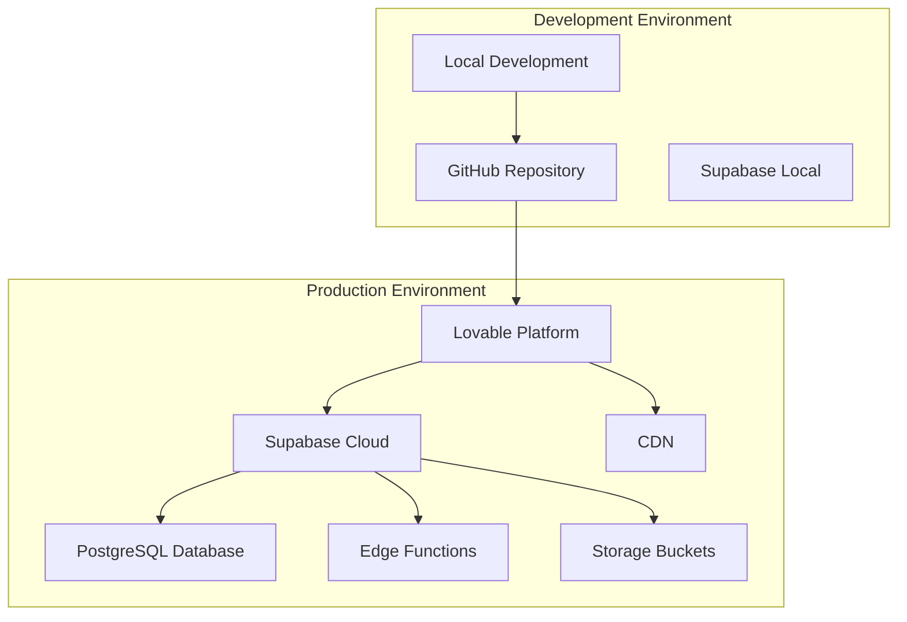
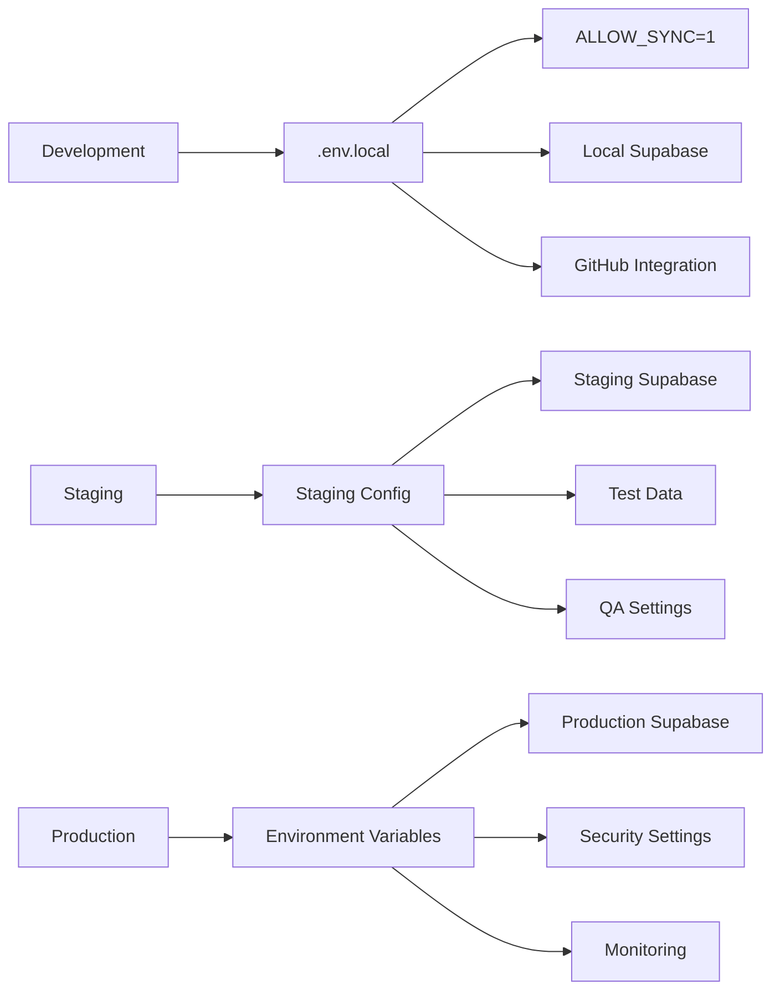

# Deployment Guide - Station-2100

[](https://raw.githubusercontent.com/gtthande/dev-profiles/main/Dev_Profile_and_Cursor_Prompt_Pack.md)

## Overview

This guide provides comprehensive instructions for deploying Station-2100 in various environments, from development to production. The system is designed to be deployed on modern cloud platforms with Supabase as the backend service, following the Cubic Matrix v5 methodology for consistent deployment practices.

## Deployment Architecture

### Production Deployment



### Environment Configuration



## Prerequisites

### System Requirements

- **Node.js**: v18 or higher
- **npm**: Latest version
- **Git**: For version control
- **Supabase Account**: For backend services

### Required Accounts

- **Supabase**: For database and backend services
- **GitHub**: For source code management
- **Lovable**: For deployment platform (recommended)
- **Domain Provider**: For custom domain (optional)

## Environment Setup

### Development Environment

#### 1. Clone Repository

```bash
git clone https://github.com/gtthande/Station-2100.git
cd Station-2100
```

#### 2. Install Dependencies

```bash
npm install
```

#### 3. Environment Configuration

Create `.env.local` file:

```env
# Supabase Configuration
VITE_SUPABASE_URL=https://jarlvtojzqkccovburmi.supabase.co
VITE_SUPABASE_ANON_KEY=your-anon-key-here
SUPABASE_SERVICE_ROLE_KEY=your-service-role-key-here

# Development Sync
ALLOW_SYNC=1
SUPABASE_DB_PASSWORD=Series-2100Station-2100

# GitHub Integration (Optional)
VITE_GITHUB_REPO=gtthande/Station-2100
VITE_GITHUB_TOKEN=your-github-token-here

# Security (Optional)
HAVEIBEENPWNED_API_KEY=your-hibp-api-key-here
```

#### 4. Start Development Server

```bash
npm run dev
```

### Staging Environment

#### 1. Create Staging Supabase Project

1. Go to [Supabase Dashboard](https://supabase.com/dashboard)
2. Click "New Project"
3. Choose "Staging" as project name
4. Select appropriate region
5. Set database password
6. Wait for project creation

#### 2. Configure Staging Environment

```env
# Staging Supabase Configuration
VITE_SUPABASE_URL=https://your-staging-project.supabase.co
VITE_SUPABASE_ANON_KEY=your-staging-anon-key
SUPABASE_SERVICE_ROLE_KEY=your-staging-service-role-key

# Staging Settings
VITE_ENVIRONMENT=staging
VITE_ENABLE_ANALYTICS=false
VITE_ENABLE_ERROR_REPORTING=true
```

#### 3. Deploy to Staging

```bash
# Build for staging
npm run build

# Deploy to staging platform
# (Follow platform-specific instructions)
```

### Production Environment

#### 1. Create Production Supabase Project

1. Go to [Supabase Dashboard](https://supabase.com/dashboard)
2. Click "New Project"
3. Choose "Production" as project name
4. Select production region
5. Set strong database password
6. Enable all security features
7. Wait for project creation

#### 2. Configure Production Environment

```env
# Production Supabase Configuration
VITE_SUPABASE_URL=https://your-production-project.supabase.co
VITE_SUPABASE_ANON_KEY=your-production-anon-key
SUPABASE_SERVICE_ROLE_KEY=your-production-service-role-key

# Production Settings
VITE_ENVIRONMENT=production
VITE_ENABLE_ANALYTICS=true
VITE_ENABLE_ERROR_REPORTING=true
VITE_ENABLE_MONITORING=true
```

## Deployment Methods

### Method 1: Lovable Platform (Recommended)

#### 1. Prepare for Deployment

```bash
# Build project
npm run build

# Run type checking
npm run type-check

# Run security audit
npm audit
```

#### 2. Deploy via Lovable

1. **Open Lovable Interface**
   - Navigate to your project in Lovable
   - Click "Publish" button

2. **Configure Deployment**
   - Set environment variables
   - Configure custom domain (if required)
   - Set up monitoring and analytics

3. **Verify Deployment**
   - Check deployment health
   - Test all functionality
   - Verify environment variables

#### 3. Post-Deployment Configuration

```bash
# Verify deployment
curl https://your-domain.com/api/health

# Check database connectivity
curl https://your-domain.com/api/health/db

# Verify authentication
curl https://your-domain.com/api/health/auth
```

### Method 2: Vercel Deployment

#### 1. Install Vercel CLI

```bash
npm install -g vercel
```

#### 2. Configure Vercel

Create `vercel.json`:

```json
{
  "builds": [
    {
      "src": "package.json",
      "use": "@vercel/static-build",
      "config": {
        "distDir": "dist"
      }
    }
  ],
  "routes": [
    {
      "src": "/(.*)",
      "dest": "/index.html"
    }
  ],
  "env": {
    "VITE_SUPABASE_URL": "@supabase-url",
    "VITE_SUPABASE_ANON_KEY": "@supabase-anon-key"
  }
}
```

#### 3. Deploy to Vercel

```bash
# Login to Vercel
vercel login

# Deploy
vercel

# Set environment variables
vercel env add VITE_SUPABASE_URL
vercel env add VITE_SUPABASE_ANON_KEY
vercel env add SUPABASE_SERVICE_ROLE_KEY
```

### Method 3: Netlify Deployment

#### 1. Build Configuration

Create `netlify.toml`:

```toml
[build]
  command = "npm run build"
  publish = "dist"

[build.environment]
  NODE_VERSION = "18"

[[redirects]]
  from = "/*"
  to = "/index.html"
  status = 200
```

#### 2. Deploy to Netlify

```bash
# Build project
npm run build

# Deploy to Netlify
# Upload dist/ folder or connect Git repository
```

#### 3. Configure Environment Variables

In Netlify Dashboard:
1. Go to Site Settings
2. Navigate to Environment Variables
3. Add required variables:
   - `VITE_SUPABASE_URL`
   - `VITE_SUPABASE_ANON_KEY`
   - `SUPABASE_SERVICE_ROLE_KEY`

### Method 4: Docker Deployment

#### 1. Create Dockerfile

```dockerfile
FROM node:18-alpine AS builder

WORKDIR /app
COPY package*.json ./
RUN npm ci --only=production

COPY . .
RUN npm run build

FROM nginx:alpine
COPY --from=builder /app/dist /usr/share/nginx/html
COPY nginx.conf /etc/nginx/nginx.conf

EXPOSE 80
CMD ["nginx", "-g", "daemon off;"]
```

#### 2. Create nginx.conf

```nginx
events {
    worker_connections 1024;
}

http {
    include /etc/nginx/mime.types;
    default_type application/octet-stream;

    server {
        listen 80;
        server_name localhost;
        root /usr/share/nginx/html;
        index index.html;

        location / {
            try_files $uri $uri/ /index.html;
        }

        location /api/ {
            proxy_pass https://your-supabase-url.supabase.co;
            proxy_set_header Host $host;
            proxy_set_header X-Real-IP $remote_addr;
        }
    }
}
```

#### 3. Build and Run Docker Container

```bash
# Build Docker image
docker build -t station-2100 .

# Run container
docker run -p 80:80 -e VITE_SUPABASE_URL=your-url station-2100
```

## Database Migration

### Production Database Setup

#### 1. Run Migrations

```bash
# Push all migrations to production
npx supabase db push --password "your-production-password"
```

#### 2. Verify Database Schema

```sql
-- Check if all tables exist
SELECT table_name 
FROM information_schema.tables 
WHERE table_schema = 'public';

-- Check if all functions exist
SELECT routine_name 
FROM information_schema.routines 
WHERE routine_schema = 'public';
```

#### 3. Set Up Initial Data

```sql
-- Create admin user
INSERT INTO public.profiles (
  id, email, full_name, position, is_staff, staff_active
) VALUES (
  'your-admin-user-id', 'admin@yourcompany.com', 'Admin User', 
  'System Administrator', true, true
);

-- Assign admin role
INSERT INTO public.user_roles (user_id, role)
VALUES ('your-admin-user-id', 'admin');
```

### Data Migration

#### 1. Export Development Data

```bash
# Export data from development database
pg_dump -h localhost -U postgres -d station2100_dev > dev_data.sql
```

#### 2. Import to Production

```bash
# Import data to production database
psql -h your-production-host -U postgres -d station2100_prod < dev_data.sql
```

## Security Configuration

### Production Security Settings

#### 1. Supabase Security Configuration

```sql
-- Enable Row Level Security on all tables
ALTER TABLE public.profiles ENABLE ROW LEVEL SECURITY;
ALTER TABLE public.inventory_products ENABLE ROW LEVEL SECURITY;
ALTER TABLE public.customers ENABLE ROW LEVEL SECURITY;
-- ... (enable for all tables)

-- Create security policies
CREATE POLICY "Users can view own profile" ON public.profiles
  FOR SELECT USING (auth.uid() = id);

-- ... (create all security policies)
```

#### 2. Authentication Settings

In Supabase Dashboard:
1. **Authentication → Settings**
   - Enable email confirmation
   - Set password minimum length to 8
   - Enable password strength requirements
   - Configure rate limiting

2. **Authentication → Providers**
   - Configure email provider
   - Set up custom SMTP (optional)

#### 3. API Security

```typescript
// API security configuration
const apiSecurity = {
  cors: {
    origin: ['https://yourdomain.com'],
    credentials: true
  },
  rateLimit: {
    windowMs: 15 * 60 * 1000, // 15 minutes
    max: 100 // limit each IP to 100 requests per windowMs
  },
  helmet: {
    contentSecurityPolicy: {
      directives: {
        defaultSrc: ["'self'"],
        styleSrc: ["'self'", "'unsafe-inline'"],
        scriptSrc: ["'self'"],
        imgSrc: ["'self'", "data:", "https:"]
      }
    }
  }
}
```

## Monitoring & Health Checks

### Health Check Endpoints

#### 1. Application Health

```typescript
// Health check endpoint
app.get('/api/health', async (req, res) => {
  const health = {
    status: 'healthy',
    timestamp: new Date().toISOString(),
    uptime: process.uptime(),
    version: process.env.npm_package_version,
    environment: process.env.NODE_ENV
  }
  
  res.json(health)
})
```

#### 2. Database Health

```typescript
// Database health check
app.get('/api/health/db', async (req, res) => {
  try {
    const { data, error } = await supabase
      .from('profiles')
      .select('count')
      .limit(1)
    
    if (error) throw error
    
    res.json({
      status: 'healthy',
      database: 'connected',
      timestamp: new Date().toISOString()
    })
  } catch (error) {
    res.status(500).json({
      status: 'unhealthy',
      database: 'disconnected',
      error: error.message,
      timestamp: new Date().toISOString()
    })
  }
})
```

#### 3. Authentication Health

```typescript
// Authentication health check
app.get('/api/health/auth', async (req, res) => {
  try {
    const { data, error } = await supabase.auth.getSession()
    
    res.json({
      status: 'healthy',
      authentication: 'working',
      timestamp: new Date().toISOString()
    })
  } catch (error) {
    res.status(500).json({
      status: 'unhealthy',
      authentication: 'error',
      error: error.message,
      timestamp: new Date().toISOString()
    })
  }
})
```

### Monitoring Setup

#### 1. Application Monitoring

```typescript
// Monitoring configuration
const monitoring = {
  metrics: {
    responseTime: true,
    errorRate: true,
    throughput: true,
    memoryUsage: true,
    cpuUsage: true
  },
  alerts: {
    errorRate: 0.05, // 5% error rate threshold
    responseTime: 2000, // 2 second response time threshold
    memoryUsage: 0.8 // 80% memory usage threshold
  },
  reporting: {
    interval: 60000, // 1 minute
    retention: 2592000000 // 30 days
  }
}
```

#### 2. Database Monitoring

```sql
-- Database monitoring queries
-- Check database size
SELECT pg_size_pretty(pg_database_size('station2100'));

-- Check table sizes
SELECT 
  schemaname,
  tablename,
  pg_size_pretty(pg_total_relation_size(schemaname||'.'||tablename)) as size
FROM pg_tables 
WHERE schemaname = 'public'
ORDER BY pg_total_relation_size(schemaname||'.'||tablename) DESC;

-- Check active connections
SELECT count(*) as active_connections 
FROM pg_stat_activity 
WHERE state = 'active';
```

## Performance Optimization

### Frontend Optimization

#### 1. Build Optimization

```typescript
// vite.config.ts
export default defineConfig({
  build: {
    rollupOptions: {
      output: {
        manualChunks: {
          vendor: ['react', 'react-dom'],
          supabase: ['@supabase/supabase-js'],
          ui: ['@radix-ui/react-dialog', '@radix-ui/react-dropdown-menu']
        }
      }
    },
    chunkSizeWarningLimit: 1000
  }
})
```

#### 2. Code Splitting

```typescript
// Lazy load components
const AdminPanel = lazy(() => import('./pages/Admin'))
const Inventory = lazy(() => import('./pages/Inventory'))
const JobCards = lazy(() => import('./pages/JobCards'))

// Use Suspense for loading states
<Suspense fallback={<LoadingSpinner />}>
  <AdminPanel />
</Suspense>
```

### Backend Optimization

#### 1. Database Indexing

```sql
-- Create indexes for frequently queried columns
CREATE INDEX idx_profiles_email ON public.profiles(email);
CREATE INDEX idx_inventory_products_user_id ON public.inventory_products(user_id);
CREATE INDEX idx_customers_user_id ON public.customers(user_id);
CREATE INDEX idx_job_cards_user_id ON public.job_cards(user_id);

-- Composite indexes for complex queries
CREATE INDEX idx_inventory_batches_user_product ON public.inventory_batches(user_id, product_id);
CREATE INDEX idx_rotable_parts_user_status ON public.rotable_parts(user_id, status);
```

#### 2. Query Optimization

```typescript
// Optimize queries with proper selection
const { data, error } = await supabase
  .from('inventory_products')
  .select('id, part_number, description, unit_cost') // Select only needed columns
  .eq('user_id', user.id)
  .order('created_at', { ascending: false })
  .limit(50) // Limit results
```

## Backup & Recovery

### Database Backup

#### 1. Automated Backups

```bash
#!/bin/bash
# backup.sh - Automated database backup script

DATE=$(date +%Y%m%d_%H%M%S)
BACKUP_FILE="station2100_backup_$DATE.sql"

# Create backup
pg_dump -h your-host -U postgres -d station2100 > $BACKUP_FILE

# Compress backup
gzip $BACKUP_FILE

# Upload to cloud storage
aws s3 cp $BACKUP_FILE.gz s3://your-backup-bucket/

# Clean up old backups (keep last 30 days)
find . -name "station2100_backup_*.sql.gz" -mtime +30 -delete
```

#### 2. Backup Verification

```bash
#!/bin/bash
# verify_backup.sh - Verify backup integrity

BACKUP_FILE=$1

# Test backup file
gunzip -t $BACKUP_FILE.gz

# Restore to test database
createdb station2100_test
gunzip -c $BACKUP_FILE.gz | psql station2100_test

# Verify data integrity
psql station2100_test -c "SELECT count(*) FROM profiles;"
psql station2100_test -c "SELECT count(*) FROM inventory_products;"

# Clean up test database
dropdb station2100_test
```

### Disaster Recovery

#### 1. Recovery Procedures

```bash
#!/bin/bash
# disaster_recovery.sh - Disaster recovery script

# 1. Restore database
psql -h your-host -U postgres -d station2100 < latest_backup.sql

# 2. Verify data integrity
psql -h your-host -U postgres -d station2100 -c "SELECT count(*) FROM profiles;"

# 3. Restart application services
systemctl restart station2100

# 4. Verify application health
curl https://your-domain.com/api/health
```

#### 2. Recovery Testing

```bash
#!/bin/bash
# test_recovery.sh - Test disaster recovery procedures

# Create test environment
createdb station2100_recovery_test

# Restore backup
psql station2100_recovery_test < latest_backup.sql

# Run integrity checks
psql station2100_recovery_test -c "SELECT count(*) FROM profiles;"
psql station2100_recovery_test -c "SELECT count(*) FROM inventory_products;"
psql station2100_recovery_test -c "SELECT count(*) FROM customers;"

# Clean up
dropdb station2100_recovery_test
```

## Troubleshooting

### Common Deployment Issues

#### 1. Environment Variables

**Problem**: Application not loading environment variables

**Solution**:
```bash
# Check environment variables
echo $VITE_SUPABASE_URL
echo $VITE_SUPABASE_ANON_KEY

# Verify .env file exists
ls -la .env*

# Check build process
npm run build
```

#### 2. Database Connection

**Problem**: Cannot connect to database

**Solution**:
```bash
# Test database connection
psql -h your-host -U postgres -d station2100 -c "SELECT 1;"

# Check Supabase connection
curl -H "apikey: your-anon-key" https://your-project.supabase.co/rest/v1/
```

#### 3. Build Failures

**Problem**: Build process failing

**Solution**:
```bash
# Clear cache
npm cache clean --force
rm -rf node_modules package-lock.json

# Reinstall dependencies
npm install

# Check for TypeScript errors
npm run type-check

# Build again
npm run build
```

### Performance Issues

#### 1. Slow Database Queries

**Problem**: Database queries taking too long

**Solution**:
```sql
-- Check slow queries
SELECT query, mean_time, calls 
FROM pg_stat_statements 
ORDER BY mean_time DESC 
LIMIT 10;

-- Add missing indexes
CREATE INDEX idx_table_column ON table_name(column_name);

-- Optimize queries
EXPLAIN ANALYZE SELECT * FROM table_name WHERE condition;
```

#### 2. High Memory Usage

**Problem**: Application using too much memory

**Solution**:
```bash
# Check memory usage
ps aux | grep node

# Monitor memory usage
node --inspect app.js

# Optimize memory usage
# - Use streaming for large datasets
# - Implement pagination
# - Clear unused data from memory
```

## Conclusion

This deployment guide provides comprehensive instructions for deploying Station-2100 in various environments. The system is designed to be scalable, secure, and maintainable, with proper monitoring and backup procedures in place.

Following the best practices outlined in this guide will ensure a successful deployment and smooth operation of the Station-2100 aviation management system.
