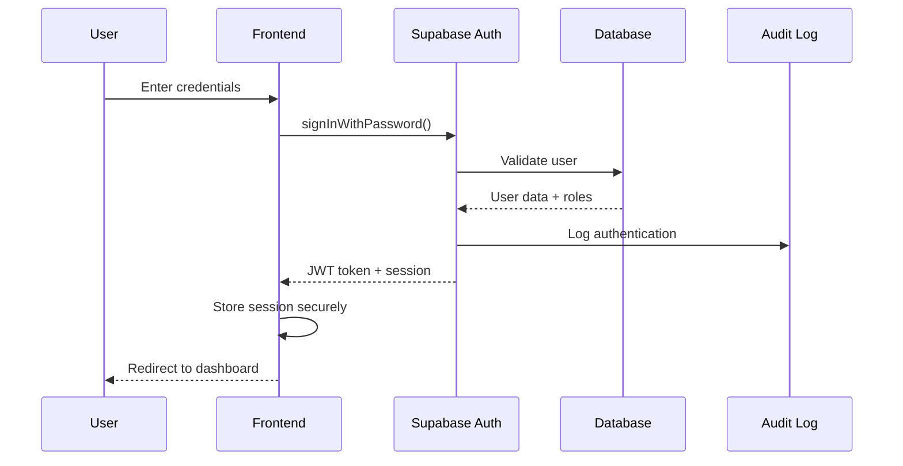
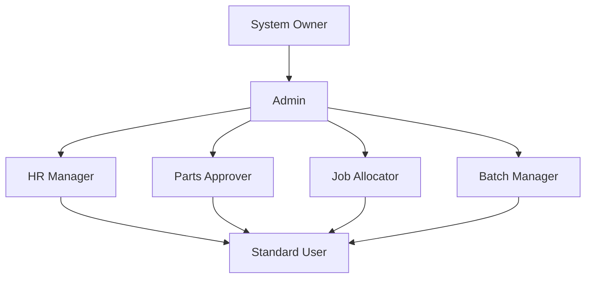
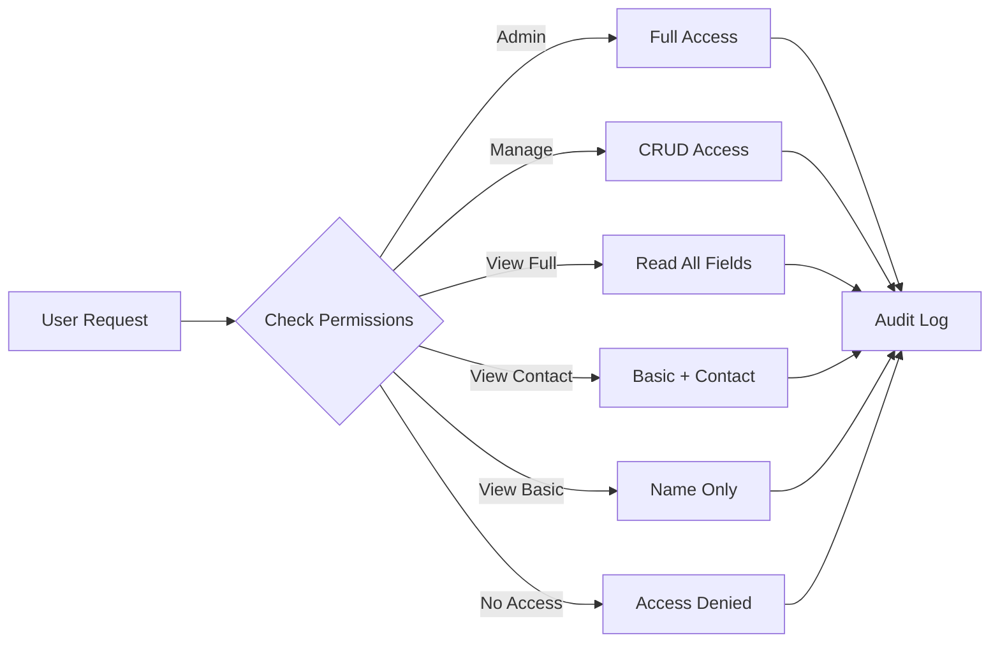
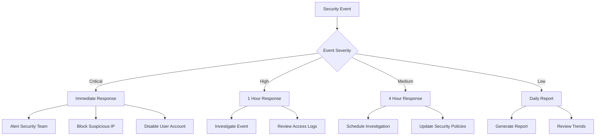
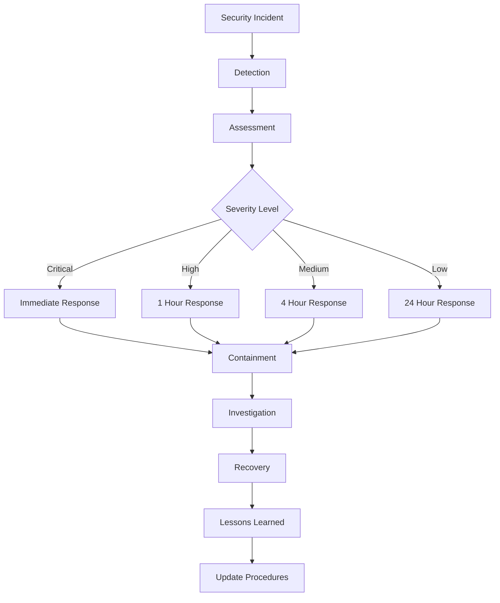

# Security Architecture - Station-2100

## Overview

Station-2100 implements a comprehensive security architecture designed to protect sensitive aviation data and ensure compliance with industry standards. The security model is built on multiple layers of protection, from authentication and authorization to data encryption and audit logging.

## Security Principles

### Defense in Depth

The system implements multiple layers of security:

1. **Network Security**: HTTPS, CORS policies, rate limiting
2. **Authentication**: Multi-factor authentication ready, secure password policies
3. **Authorization**: Role-based access control with granular permissions
4. **Data Protection**: Encryption at rest and in transit, data masking
5. **Audit Logging**: Comprehensive logging of all security events
6. **Monitoring**: Real-time security monitoring and alerting

### Principle of Least Privilege

Users are granted only the minimum permissions necessary to perform their job functions. Access is regularly reviewed and can be revoked or modified as needed.

## Authentication Architecture

### Authentication Flow



### Password Security

#### Password Requirements

- **Minimum Length**: 8 characters
- **Complexity**: Must contain uppercase, lowercase, numbers, and special characters
- **Breach Detection**: Automatic checking against HaveIBeenPwned database
- **Strength Validation**: Real-time password strength assessment

#### Password Storage

- **Hashing**: Passwords are hashed using bcrypt with salt
- **Storage**: Hashed passwords stored in Supabase auth.users table
- **Transmission**: Passwords transmitted over HTTPS only

### Session Management

#### JWT Tokens

- **Access Token**: Short-lived (1 hour) for API access
- **Refresh Token**: Long-lived (30 days) for token renewal
- **Storage**: Tokens stored in secure HTTP-only cookies
- **Rotation**: Refresh tokens rotated on each use

#### Session Security

```typescript
// Session configuration
const sessionConfig = {
  accessTokenExpiry: 3600, // 1 hour
  refreshTokenExpiry: 2592000, // 30 days
  secure: true, // HTTPS only
  httpOnly: true, // No JavaScript access
  sameSite: 'strict' // CSRF protection
}
```

## Authorization Architecture

### Role-Based Access Control (RBAC)

#### Role Hierarchy



#### Role Definitions

| Role | Capabilities | Data Access |
|------|-------------|-------------|
| **System Owner** | Full system control, user management, security settings | All data |
| **Admin** | User management, system settings, full data access | All data |
| **HR Manager** | User management, profile access, staff administration | Staff data, limited customer data |
| **Parts Approver** | Inventory approval, batch management | Inventory data, approval workflows |
| **Job Allocator** | Job card allocation, workflow management | Job cards, customer data |
| **Batch Manager** | Batch operations, inventory management | Inventory data, batch operations |
| **Standard User** | Basic operations, own data access | Own data only |

### Permission-Based Access Control

#### Customer Data Permissions



#### Permission Levels

- **Admin**: Full access to all customer data
- **Manage**: Create, read, update, delete customer records
- **View Full**: Access to all customer fields including contact information
- **View Contact**: Basic information plus phone/email
- **View Basic**: Company name and basic information only

### Row Level Security (RLS)

#### RLS Policy Examples

```sql
-- Profile access policy
CREATE POLICY "Ultra-restrictive profile access with audit logging"
ON public.profiles FOR SELECT
TO authenticated
USING (
  auth.uid() = id OR 
  (
    (has_role(auth.uid(), 'admin'::app_role) OR has_role(auth.uid(), 'hr'::app_role)) 
    AND secure_profile_access(id, 'view')
  )
);

-- Customer access policy
CREATE POLICY "Admin and manager customer access"
ON public.customers FOR SELECT
TO authenticated
USING (
  auth.uid() = user_id AND (
    has_role(auth.uid(), 'admin'::app_role) OR 
    get_user_customer_permission_level(auth.uid()) = 'manage'
  )
);

-- Inventory batch policy
CREATE POLICY "Role-based batch updates"
ON public.inventory_batches FOR UPDATE
TO authenticated
USING (
  auth.uid() = user_id AND (
    has_role(auth.uid(), 'admin'::app_role) OR
    (has_role(auth.uid(), 'parts_approver'::app_role) AND approval_status = 'pending') OR
    (has_role(auth.uid(), 'job_allocator'::app_role) AND approval_status = 'approved') OR
    has_role(auth.uid(), 'batch_manager'::app_role)
  )
);
```

## Data Protection

### Encryption

#### Data at Rest

- **Database**: AES-256 encryption for all data
- **File Storage**: AES-256 encryption for uploaded files
- **Backups**: Encrypted backups with separate key management

#### Data in Transit

- **HTTPS**: All communications encrypted with TLS 1.3
- **API Calls**: All API calls use HTTPS
- **WebSocket**: Secure WebSocket connections for real-time features

### Data Masking

#### Sensitive Data Protection

```typescript
// Data masking example
const maskSensitiveData = (data: any, userPermissions: string[]) => {
  if (!userPermissions.includes('view_full')) {
    return {
      ...data,
      email: '[PROTECTED]',
      phone: '[PROTECTED]',
      address: '[PROTECTED]'
    }
  }
  return data
}
```

#### Field-Level Security

- **Email**: Masked unless user has 'view_full' permission
- **Phone**: Masked unless user has 'view_contact' or higher permission
- **Address**: Masked unless user has 'view_full' permission
- **Badge ID**: Restricted to admin users only

### Data Anonymization

#### Audit Log Anonymization

```sql
-- Anonymize sensitive data in audit logs
CREATE OR REPLACE FUNCTION anonymize_audit_data()
RETURNS TRIGGER AS $$
BEGIN
  -- Mask email addresses
  NEW.email = CASE 
    WHEN NEW.email IS NOT NULL THEN 
      SUBSTRING(NEW.email, 1, 2) || '***@' || 
      SUBSTRING(NEW.email FROM '@(.*)$')
    ELSE NEW.email
  END;
  
  -- Mask phone numbers
  NEW.phone = CASE 
    WHEN NEW.phone IS NOT NULL THEN 
      SUBSTRING(NEW.phone, 1, 3) || '***' || 
      SUBSTRING(NEW.phone, -4)
    ELSE NEW.phone
  END;
  
  RETURN NEW;
END;
$$ LANGUAGE plpgsql;
```

## Audit Logging

### Comprehensive Audit Trail

#### Security Events Logged

- **Authentication Events**: Login, logout, failed attempts
- **Authorization Events**: Permission checks, role changes
- **Data Access Events**: Profile access, customer data access
- **Data Modification Events**: Create, update, delete operations
- **System Events**: Configuration changes, security settings

#### Audit Log Structure

```sql
CREATE TABLE public.audit_log (
  id UUID PRIMARY KEY DEFAULT gen_random_uuid(),
  user_id UUID REFERENCES auth.users(id),
  action TEXT NOT NULL,
  resource_type TEXT NOT NULL,
  resource_id UUID,
  old_values JSONB,
  new_values JSONB,
  ip_address INET,
  user_agent TEXT,
  session_id TEXT,
  created_at TIMESTAMPTZ DEFAULT NOW()
);
```

### Security Audit Log

#### Profile Access Logging

```sql
CREATE TABLE public.profile_security_log (
  id UUID PRIMARY KEY DEFAULT gen_random_uuid(),
  profile_id UUID NOT NULL,
  accessed_by UUID NOT NULL,
  access_type TEXT NOT NULL,
  access_granted BOOLEAN DEFAULT true,
  denial_reason TEXT,
  ip_address INET,
  user_agent TEXT,
  session_info JSONB,
  created_at TIMESTAMPTZ DEFAULT NOW()
);
```

#### Customer Access Logging

```sql
CREATE TABLE public.customer_access_log (
  id UUID PRIMARY KEY DEFAULT gen_random_uuid(),
  customer_id UUID NOT NULL,
  user_id UUID NOT NULL,
  action TEXT NOT NULL,
  permission_level TEXT,
  ip_address INET,
  user_agent TEXT,
  created_at TIMESTAMPTZ DEFAULT NOW()
);
```

### Emergency Access Procedures

#### Emergency Profile Access

```sql
CREATE OR REPLACE FUNCTION emergency_profile_access(
  _profile_id UUID,
  _justification TEXT
)
RETURNS JSON AS $$
DECLARE
  result JSON;
BEGIN
  -- Check if user has admin role
  IF NOT has_role(auth.uid(), 'admin'::app_role) THEN
    RAISE EXCEPTION 'Insufficient privileges for emergency access';
  END IF;
  
  -- Validate justification length
  IF LENGTH(_justification) < 10 THEN
    RAISE EXCEPTION 'Justification must be at least 10 characters';
  END IF;
  
  -- Log emergency access
  INSERT INTO public.profile_security_log (
    profile_id, accessed_by, access_type, access_granted,
    session_info, created_at
  ) VALUES (
    _profile_id, auth.uid(), 'emergency_access', true,
    jsonb_build_object('justification', _justification), NOW()
  );
  
  -- Return limited profile data
  SELECT json_build_object(
    'id', p.id,
    'email', p.email,
    'full_name', p.full_name,
    'position', p.position,
    'is_staff', p.is_staff,
    'staff_active', p.staff_active,
    'emergency_access', true,
    'accessed_at', NOW()
  ) INTO result
  FROM public.profiles p
  WHERE p.id = _profile_id;
  
  RETURN result;
END;
$$ LANGUAGE plpgsql SECURITY DEFINER;
```

## Security Monitoring

### Real-time Monitoring

#### Security Event Detection

```typescript
// Security monitoring configuration
const securityMonitoring = {
  failedLoginThreshold: 5, // 5 failed attempts
  suspiciousActivityWindow: 300000, // 5 minutes
  alertChannels: ['email', 'slack', 'dashboard'],
  escalationRules: {
    critical: ['immediate', 'admin', 'security_team'],
    high: ['within_1_hour', 'admin'],
    medium: ['within_4_hours', 'security_team'],
    low: ['daily_report']
  }
}
```

#### Anomaly Detection

- **Unusual Access Patterns**: Access from new locations or devices
- **Bulk Data Access**: Large data downloads or exports
- **Permission Escalation**: Attempts to access restricted data
- **Failed Authentication**: Multiple failed login attempts

### Security Alerts

#### Alert Types

- **Critical**: Security breaches, unauthorized access attempts
- **High**: Suspicious activity, permission violations
- **Medium**: Failed authentication, unusual access patterns
- **Low**: Configuration changes, routine security events

#### Alert Response



## Compliance & Standards

### Aviation Industry Standards

#### Data Protection Requirements

- **Customer Data**: Protection of customer information and aircraft details
- **Operational Data**: Security of maintenance records and job cards
- **Financial Data**: Protection of cost and pricing information
- **Personnel Data**: Security of employee information and access controls

#### Audit Requirements

- **Access Logs**: Comprehensive logging of all data access
- **Change Tracking**: Audit trail of all data modifications
- **User Management**: Tracking of user account changes and permissions
- **Security Events**: Logging of all security-related events

### Regulatory Compliance

#### Data Retention

- **Audit Logs**: 7 years retention
- **User Data**: 3 years after account closure
- **Operational Data**: 5 years retention
- **Security Events**: 10 years retention

#### Data Disposal

- **Secure Deletion**: Cryptographic erasure of sensitive data
- **Media Destruction**: Physical destruction of storage media
- **Documentation**: Certificate of destruction for compliance

## Security Best Practices

### Development Security

#### Secure Coding Practices

- **Input Validation**: Validate all user inputs
- **SQL Injection Prevention**: Use parameterized queries
- **XSS Prevention**: Sanitize user-generated content
- **CSRF Protection**: Implement CSRF tokens

#### Code Review Process

- **Security Review**: All code changes reviewed for security issues
- **Automated Scanning**: Static analysis tools for vulnerability detection
- **Dependency Scanning**: Regular scanning of third-party dependencies
- **Penetration Testing**: Regular security testing

### Operational Security

#### Access Management

- **Regular Reviews**: Quarterly review of user access and permissions
- **Principle of Least Privilege**: Users granted minimum necessary access
- **Separation of Duties**: Critical functions require multiple approvals
- **Background Checks**: Security clearance for sensitive roles

#### Incident Response



## Security Testing

### Vulnerability Assessment

#### Regular Testing

- **Automated Scanning**: Weekly vulnerability scans
- **Penetration Testing**: Quarterly penetration tests
- **Code Review**: Security-focused code reviews
- **Dependency Scanning**: Regular dependency vulnerability checks

#### Testing Tools

- **Static Analysis**: SonarQube, ESLint security rules
- **Dynamic Analysis**: OWASP ZAP, Burp Suite
- **Dependency Scanning**: npm audit, Snyk
- **Infrastructure Scanning**: Nessus, OpenVAS

### Security Metrics

#### Key Performance Indicators

- **Mean Time to Detection (MTTD)**: Time to detect security incidents
- **Mean Time to Response (MTTR)**: Time to respond to security incidents
- **Vulnerability Remediation Time**: Time to fix identified vulnerabilities
- **Security Training Completion**: Percentage of staff completing security training

#### Security Dashboard

```typescript
// Security metrics dashboard
const securityMetrics = {
  activeThreats: 0,
  failedLogins: 12,
  blockedIPs: 3,
  securityAlerts: 1,
  vulnerabilityCount: 5,
  lastScanDate: '2024-01-15',
  complianceScore: 95
}
```

## Conclusion

The Station-2100 security architecture provides comprehensive protection for sensitive aviation data through multiple layers of security controls. The system implements industry best practices for authentication, authorization, data protection, and audit logging, ensuring compliance with aviation industry standards and regulatory requirements.

Regular security assessments, monitoring, and incident response procedures ensure that the system remains secure and resilient against evolving threats. The security architecture is designed to be scalable and adaptable to changing security requirements and threat landscapes.
