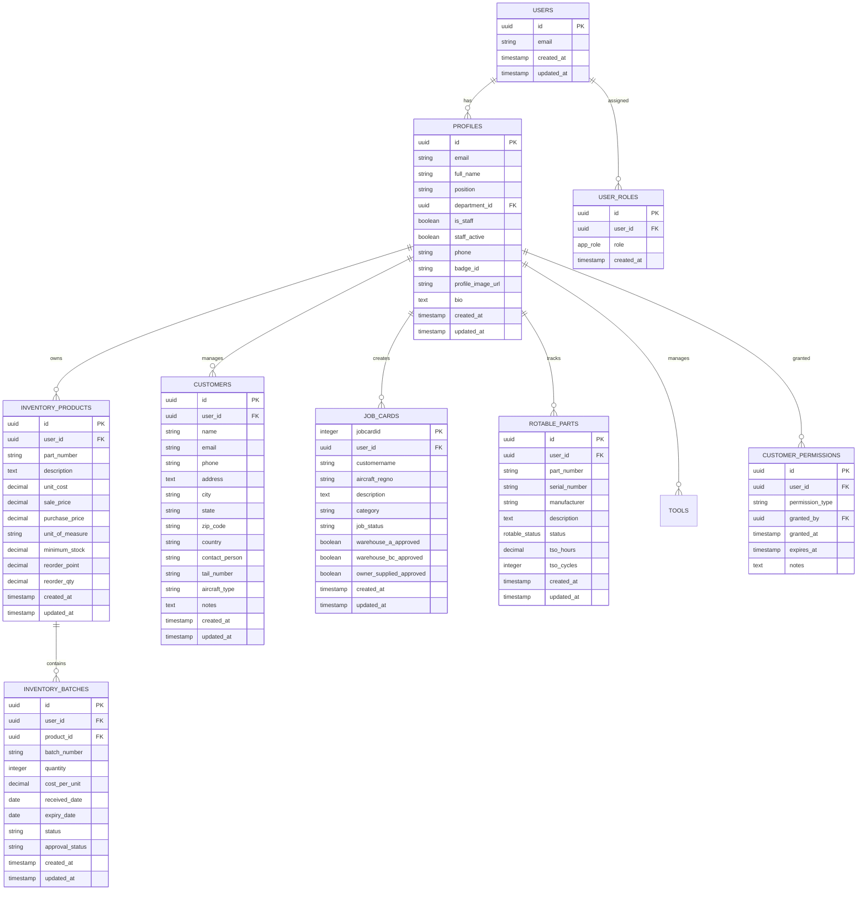

# System Architecture - Station-2100

[](https://raw.githubusercontent.com/gtthande/dev-profiles/main/Dev_Profile_and_Cursor_Prompt_Pack.md)

## Overview

Station-2100 is built on a modern, scalable architecture that separates concerns between the frontend, backend, and data layers. The system uses React 18 + TypeScript for the frontend, Supabase for the backend services, and PostgreSQL for data storage. The architecture follows the Cubic Matrix v5 methodology for consistent development practices.

## High-Level Architecture


## Component Architecture

### Frontend Components


### Data Flow Architecture


## Security Architecture

### Authentication Flow


### Authorization System


### Permission Hierarchy


## Database Architecture

### Entity Relationship Diagram



## Development Architecture

### Development Sync System


### Vite Plugin Architecture

The development sync functionality is implemented as a Vite plugin that provides middleware endpoints:

```typescript
// Vite plugin configuration
export default defineConfig({
  plugins: [
    devSyncPlugin({
      allowSync: process.env.ALLOW_SYNC === '1',
      gitRemote: process.env.GIT_REMOTE || 'origin',
      gitBranch: process.env.GIT_BRANCH || 'main',
      supabasePassword: process.env.SUPABASE_DB_PASSWORD
    })
  ]
});
```

## Deployment Architecture

### Production Deployment


### Environment Configuration


## Performance Architecture

### Caching Strategy


### Monitoring & Health Checks

```mermaid
graph TB
    A[Health Check Endpoints] --> B[/api/health]
    A --> C[/__sync/ping]
    A --> D[/__sync/status]
    
    B --> E[Application Health]
    B --> F[Database Connectivity]
    B --> G[Authentication Status]
    
    C --> H[Basic Connectivity]
    D --> I[Git Status]
    D --> J[Sync Permissions]
```

## Security Architecture

### Data Protection


### Audit Logging


## API Architecture

### REST API Endpoints


### Database Functions


## Conclusion

The Station-2100 architecture is designed for scalability, security, and maintainability. The separation of concerns between frontend, backend, and data layers ensures that the system can evolve and scale as needed. The comprehensive security architecture provides enterprise-grade protection for sensitive aviation data, while the development tools enable efficient collaboration and deployment.
